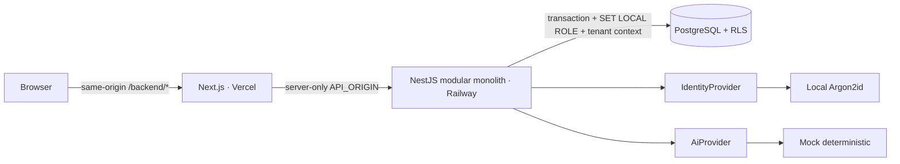
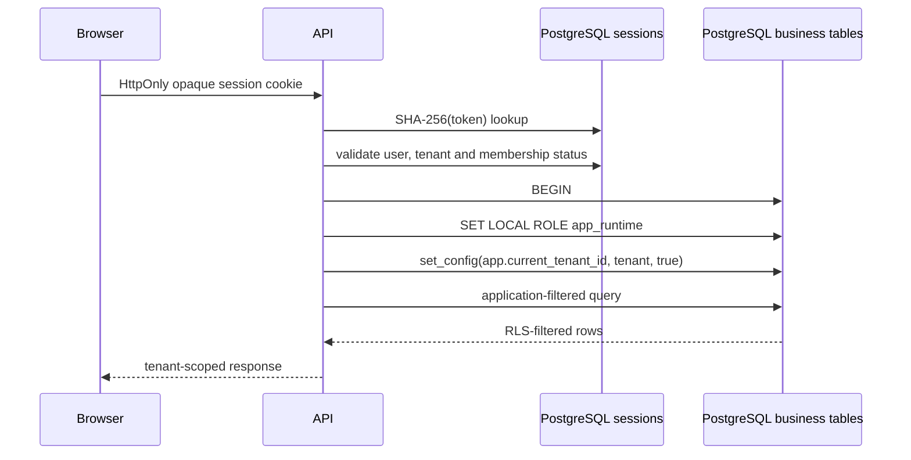

# Architecture

Sales Intelligence Platform starts as a modular monolith: one deployable API with explicit domain
modules, one web application and one PostgreSQL database. This keeps transactions and operations
simple while preserving boundaries that can be extracted only when evidence justifies it.

## Request and tenant boundary

The identity plane (`users`, credentials, sessions and memberships) is resolved before the business
tenant context. All commercial tables carry `tenant_id` and enforce the policy. Provider adapters
sit at infrastructure edges; business services import no cloud or model SDK.

## Module boundaries

- `auth`, `authorization`, `users`, `audit`: identity and policy plane.
- `opportunities`, `forecast`, `analytics`, `alerts`: current vertical slice.
- `ai`: advisory manager brief through a provider interface.
- `imports`: trusted offline ingestion command with dry-run and fingerprints.
- `health`: process and database readiness.

Later modules can follow the same boundary without adding a message bus or microservice prematurely.
